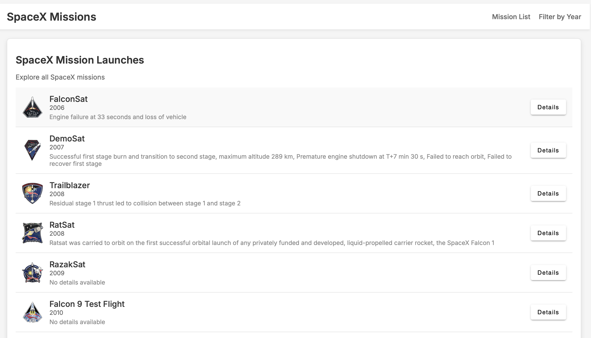
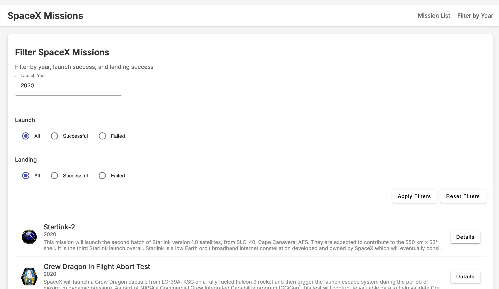
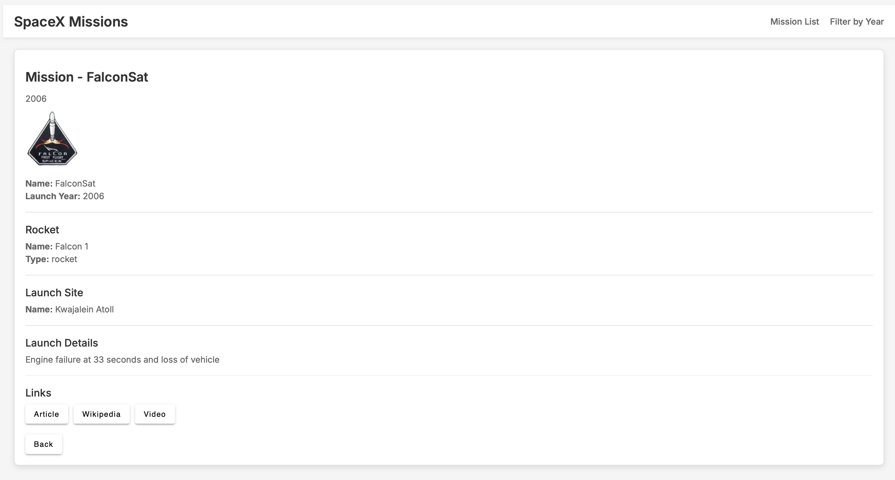

# SpaceX Missions Application

## Overview
A minimalistic Angular app to explore SpaceX launches, featuring a mission list, filtering by criteria, and detailed mission views. Designed with a light background and professional UI.

**Live Project Link**: [https://one01410211-lab-test2-comp3133.onrender.com](https://one01410211-lab-test2-comp3133.onrender.com)

## Features
- **Mission List**: View all SpaceX launches with name, date, and patch image.
- **Filter**: Filter missions by year, launch success, and landing success.
- **Mission Details**: See detailed info for a specific mission, including description and links.

## API Used
- **SpaceX API**: `https://api.spacexdata.com/v4/launches`
  
## Feature Logic
- **Filter Logic** (`/filter`):
  - Form with dropdowns for year (extracted from `date_utc`), launch success (`true/false/All`), and landing success (`true/false/All`).
  - Filters launches client-side or via API query; displays filtered list; includes a reset button.
- **Details Logic** (`/mission/:id`):
  - Fetches mission by ID from API or cached list.
  - Shows name, date, patch, description, and links (article, Wikipedia, webcast); includes a back button.

## Technologies
- Angular 17, Angular Material, TypeScript, SpaceX API, Render (hosting).

## Setup
1. **Clone Repo**:
   ```bash
   git clone https://github.com/jemish-kevadiya/101410211-lab-test2-comp3133.git
   cd 101410211-lab-test2-comp3133
   ```
2. **Install Dependencies**:
   ```bash
   npm install
   ```
3. **Run Locally**:
   ```bash
   ng serve
   ```
   - Open `http://localhost:4200`.
4. **Build for Production**:
   ```bash
   ng build --configuration production
   ```

## Below are some screenshots




